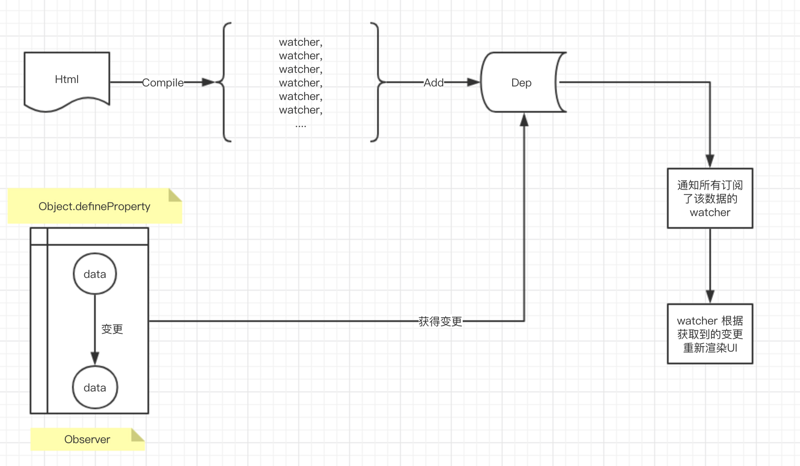

# Object.defineProperty() #
> Object.defineProperty() 用于对对象定义一个新的属性，或者修改一个对象现有的属性，并且可以设置该属性的一些特性，并返回这个对象。

<pre>
let obj = {
  name: "小红",
  age: 20
};
Object.defineProperty(obj, "name", {
  // 设置对该 name 属性的一些操作或特性
});
</pre>

它接收3个参数分别是：对象，属性，属性描述符

## 属性描述符默认值 ##
<table border style="width: 100%; text-align: center;">
  <tr>
    <th>属性</th>
    <th>默认值</th>
    <th>说明</th>
  </tr>
  <tr>
    <td>configurable</td>
    <td>false</td>
    <td>描述属性是否可以被删除，默认为 false</td>
  </tr>
  <tr>
    <td>enumerable</td>
    <td>false</td>
    <td>描述属性是否可以被for...in或Object.keys枚举，默认为 false</td>
  </tr>
  <tr>
    <td>writable</td>
    <td>false</td>
    <td>描述属性是否可以修改，默认为 false</td>
  </tr>
  <tr>
    <td>get</td>
    <td>undefined</td>
    <td>当访问属性时触发该方法，默认为undefined</td>
  </tr>
  <tr>
    <td>set</td>
    <td>undefined</td>
    <td>当属性被修改时触发该方法，默认为undefined</td>
  </tr>
  <tr>
    <td>value</td>
    <td>undefined</td>
    <td>属性值，默认为undefined</td>
  </tr>
</table>

【实例】：

<pre>
let obj = {};

Object.defineProperty(obj, "name", {
  value: "Jack"
});

console.log(obj); // {name: "Jack"}
</pre>

可以看出，给一个对象添加属性，可以是原来比较简单的方式，直接添加，也可以是这种通过 Object.defineProperty 方法去添加，而且通过 Object.defineProperty 添加的属性，可以进行描述符的一些设置（看上表）。

<pre>
let obj = {};

Object.defineProperty(obj, "name", {
  value: "Jack",
  configurable: false
});

delete obj.name; // 无法删除该属性

console.log(obj); // {name: "Jack"}
</pre>

描述符可以让你访问这些属性的时候添加一些自己的逻辑判断。在特定的情况下有特殊的处理，比如看下面一个有意思的判断：

<pre>
console.log(a === 1 && a === 2);
</pre>

让上面的条件为 true：

<pre>
let num = 0;
Object.defineProperty(window, "a", {
  get: function() {
    return ++num;
  }
});

console.log(a === 1 && a === 2); // true
</pre>

这个列子就是利用了对象属性的获取拦截来做的，当然还有其他一些方法可以做的，比如 valueOf 方法等。

## 双向数据绑定 ##
可以查看这篇文章：[https://segmentfault.com/a/1190000015427628](https://segmentfault.com/a/1190000015427628 "双向数据绑定")

下面是整个流程图：

vue 的 compile 模块会解析我们的 template（html页面）模块，把它解析成一系列的 watcher，也称为“更新函数。

当然一个页面或者一个项目中肯定有很多 watcher，因此 Vue 使用了 Dep 这个对象来存储每一个watcher，当数据发生变更，Observer（Object.defineProperty） 会调用 Dep 的 notify 方法以通知所有订阅了该数据的 watcher，让它们更新数据，举个栗子：

<pre>
&lt;input v-model=&quot;message&quot;&gt;
</pre>

Compile会解析出 v-moel 这个指令并且生成 watcher 并连接数据中的 message 和当前这个Dom对象，一旦收到这个message被变更的通知，watcher就会根据变更对这个Dom进行重新渲染。

**双向数据绑定原来如下：**

1. 数据劫持：是对数据对象的 Setter 和 Getter 实现的劫持。
2. 发布-订阅模式：当监控的数据对象被更改后，这个变更会被广播给所有订阅该数据的 watcher，然后由该 watcher 实现对页面的重新渲染。

**订阅/发布模式：观察者模式**

可以查看这篇文章：[https://segmentfault.com/a/1190000015405468](https://segmentfault.com/a/1190000015405468 "观察者模式")

下面是一个简化版的 订阅/发布模式：

<pre>
// 发布者
let publisher = {
  // 订阅者列表：里面有提供的服务和所有订阅了该服务的订阅者
  registration: {
    type1: [],
    type2: []
  },

  // 收集订阅者，把他们保存在 registration 对象里面
  subscribe: function(type, fn) {
    if (Object.keys(this.registration).includes(type)) {
      this.registration[type].push(fn);
    } else {
      console.error(`error：对不起 ${fn.name}，我们还没有提供这个服务！`);
      // throw new ReferenceError("对不起，我们还没有提供这个服务！");
    }
  },

  // 取消订阅
  unSubscribe: function(type, name) {
    if (Object.keys(this.registration).includes(type)) {
      this.registration[type].forEach((item, index) => {
        if (Object.is(item.name) === Object.is(name)) {
          this.registration[type].splice(index, 1);
        }
      });
    } else {
      console.error(`您好尊贵的 ${name}：您没有订阅该消息`);
    }
  },

  // 发布订阅
  publish: function(type, message) {
    if (Object.keys(this.registration).includes(type)) {
      for (let fn of this.registration[type]) {
        fn(message);
      }
    } else {
      console.error("error：我们还没有提供该服务，请发布者先检查下！");
    }
  }
};

// 订阅者
let personA = function(message) {
  console.log(`订阅者A：${message}`);
};
let personB = function(message) {
  console.log(`订阅者B：${message}`);
};
let personC = function(message) {
  console.log(`订阅者C：${message}`);
};

// 订阅者开始订阅消息
publisher.subscribe("type1", personA);
publisher.subscribe("type1", personB);
publisher.subscribe("type2", personB);
publisher.subscribe("type1", personC);
publisher.subscribe("type3", personC);

// 发布者发布消息
publisher.unSubscribe("type1", personC.name);
publisher.publish("type1", "我是发布者发布的消息 1！");
publisher.publish("type2", "我是发布者发布的消息 2！");
publisher.publish("type3", "我是发布者发布的消息 3！");

// 打印结果
// 订阅者A：我是发布者发布的消息 1！
// 订阅者B：我是发布者发布的消息 1！
// 订阅者B：我是发布者发布的消息 2！
// error：对不起 personC，我们还没有提供这个服务！
// error：我们还没有提供该服务，请发布者先检查下！
</pre>

## 模拟vue的双向数据绑定 ##

**1、首先是 Html**
<pre>
&lt;!DOCTYPE html&gt;
&lt;html lang=&quot;en&quot;&gt;

&lt;head&gt;
  &lt;meta charset=&quot;UTF-8&quot;&gt;
  &lt;meta name=&quot;viewport&quot; content=&quot;width=device-width, initial-scale=1.0&quot;&gt;
  &lt;meta http-equiv=&quot;X-UA-Compatible&quot; content=&quot;ie=edge&quot;&gt;
  &lt;title&gt;Object.defineProperty实现双向绑定&lt;/title&gt;
&lt;/head&gt;

&lt;body&gt;
  &lt;h1 id=&#x27;h1&#x27;&gt;&lt;/h1&gt;
  &lt;input type=&quot;text&quot; id=&quot;inp&quot; onkeyup=&quot;inputChange(event)&quot;&gt;
  &lt;input type=&quot;button&quot; value=&quot;加&quot; onclick=&quot;btnAdd()&quot; /&gt;
&lt;/body&gt;
  &lt;script src=&quot;./index.js&quot;&gt;&lt;/script&gt;
&lt;/html&gt;
</pre>

**2、然后是 index.js** 

1) 首先我们先定义一个数据源
<pre>
let vm = {
  value: 0
}
</pre>

2) 然后定义一个 Dep，用于存储watcher（收集所有的订阅者，并通知所有的订阅者接受消息，它就相当于发布者）
<pre>
let Dep = function() {
  this.list = [];
  this.add = function(watcher) {
    this.list.push(watcher);
  };
  this.notify = function(newValue) {
    this.list.forEach(fn => {
      fn(newValue);
    });
  };
};
</pre>

3) 模拟 Compile 解析 html 出来的 watchers，该 demo 涉及到两个地方的重新 render，一个是title，另一个是输入框。所以写两个watcher，然后存入Dep
<pre>
// 模拟Compile,通过对Html的解析生成一系列订阅者（watcher）
function renderInput(newValue) {
  let el = document.getElementById("inp");
  if (el) el.value = newValue;
}

function renderTitle(newValue) {
  let el = document.getElementById("h1");
  if (el) el.innerHTML = newValue;
}

// 将解析出来的 watcher 存入Dep中待用
let dep = new Dep();
dep.add(renderInput);
dep.add(renderTitle);
</pre>

4) 使用 Object.defineProperty 定义一个 observer
<pre>
function observer(vm, key, value) {
  Object.defineProperty(vm, key, {
    get: function() {
      return value;
    },
    set: function(newValue) {
      if (value !== newValue) {
        value = newValue;
        dep.notify(newValue);
      }
    }
  });
}
</pre>

5) 再将页面使用的两个方法写出来。(Vue使用的是指令对事件进行绑定，但是本文不涉及指令，所以用最原始的方法绑定事件)
<pre>
function inputChange(e) {
  let value = e.target.value;
  vm.value = value;
}

function btnAdd() {
  ++vm.value;
}
</pre>

6）主要的代码都写好后，下面第一件事就是初始化
<pre>
// 数据初始化方法
Object.keys(vm).forEach(key => {
  observer(vm, key, vm[key]);
});

// 初始化页面，将数据源渲染到UI
dep.notify(vm.value);
</pre>

这样一个简单的基于 Object.defineProperty 的双向数据绑定就完成了。

----------

【整体代码如下】：

<pre>
// 数据源
const vm = {
  value: 0
};

// Dep 用于存储 watcher（收集所有的订阅者，并通知所有的订阅者接受消息，它就相当于发布者）
let Dep = function() {
  this.list = [];
  this.add = function(watcher) {
    this.list.push(watcher);
  };
  this.notify = function(newValue) {
    this.list.forEach(fn => {
      fn(newValue);
    });
  };
};

// 模拟Compile出来的watchers，该demo涉及到两个地方的重新render，一个是title，另一个是输入框。所以写两个watcher，然后存入Dep
// 模拟Compile,通过对Html的解析生成一系列订阅者（watcher）
function renderInput(newValue) {
  let el = document.getElementById("inp");
  if (el) el.value = newValue;
}

function renderTitle(newValue) {
  let el = document.getElementById("h1");
  if (el) el.innerHTML = newValue;
}

// 将解析出来的 watcher 存入Dep中待用
let dep = new Dep();
dep.add(renderInput);
dep.add(renderTitle);

// 使用 Object.defineProperty 定义一个 observer
function observer(vm, key, value) {
  Object.defineProperty(vm, key, {
    get: function() {
      return value;
    },
    set: function(newValue) {
      if (value !== newValue) {
        value = newValue;
        dep.notify(newValue);
      }
    }
  });
}

// 主要的代码都写好后，下面第一件事就是初始化
function init() {
  // 数据初始化方法
  Object.keys(vm).forEach(key => {
    observe(vm, key, vm[key]);
  });
	
  // 初始化页面，将数据源渲染到UI
  dep.notif(vm.value);
}
init();

// 再将页面使用的两个方法写出来(Vue使用的是指令对事件进行绑定，但是这里不涉及指令，所以用最原始的方法绑定事件)
function inputChange(e) {
  let value = e.target.value;
  vm.value = value;
}

function btnAdd() {
  ++vm.value;
}
</pre>

【我们可以使用更加清楚的注释来看下】：

<pre>
// 数据源
const vm = {
  value: 0
};

// 订阅者（也就是更新函数）
let oText = function(value) {
  let el = document.getElementById("h1");
  el.innerHTML = value;
};
let oInput = function(value) {
  let el = document.getElementById("input");
  el.value = value;
};

// 发布者（收集订阅者和发布消息）
let publisher = {
  list: [],
  add: function(fn) {
    this.list.push(fn);
  },
  notify: function(value) {
    this.list.forEach(fn => {
      fn(value);
    });
  }
};

// 订阅者--订阅消息
publisher.add(oText);
publisher.add(oInput);

// 使用数据劫持来监听数据变动，然后通知发布者发布者发布消息
let obServe = function(vm, key, value) {
  Object.defineProperty(vm, key, {
    get: function() {
      return value;
    },
    set: function(newValue) {
      value = newValue;
      publisher.notify(newValue); // 发布者发布消息
    }
  });
};

// 初始化
function init() {
  Object.keys(vm).forEach(key => {
    obServe(vm, key, vm[key]);
  });
  publisher.notify(vm.value);
}
init();

// 触发事（数据变更，通知发布者该发布消息了）
function inputChange(e) {
  vm.value = e.target.value;
}
function btnAdd(e) {
  ++vm.value;
}
</pre>