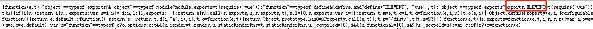
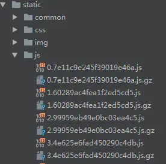
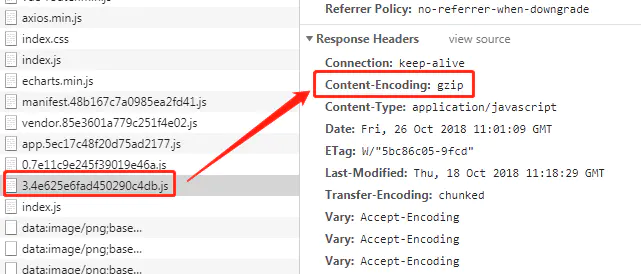

# vue首屏加载优化 #

## 1.路由异步加载 ##
<pre>
import Vue from 'vue'
import Router from 'vue-router'

// 之前的方案(同步加载模式)
// import Index from '@/pages/index/'
// import ChooseUser from '@/pages/detail/chooseUser'

// 异步加载方案
const Index = r =>
  require.ensure([], () => r(require('@/pages/index')), 'Index')
const ChooseUser = r =>
  require.ensure([], () => r(require('@/pages/detail/chooseUser')),'ChooseUser')

Vue.use(Router)

export default new Router({
  // mode:'history', // 开发阶段开启
  routes: [
    {
      path: '/board/index/:id?',
      name: 'Index',
      component: Index
    },
    {
      path: '/board/chooseUser',
      name: 'ChooseUser',
      component: ChooseUser
    }
  ]
})
</pre>

或者使用 import 这样写也可以

<pre>
{
  path: 'buyerSummary',
  name: 'buyerSummary',
  component: () => import('@/pages/index')
},
</pre>

## 2.不打包库文件 ##
spa首屏加载慢，主要是打包后的js文件过大，阻塞加载所致。那么如何减小js的体积呢？
那就是把库文件单独拿出来加载，不要参与打包。比如一些 base.css、jquery、elementUi、vue.min.js、vue-router.min.js、axios.min.js等，这样就可以告诉 wabpack 这些文件不参与打包，而是通过 cdn 的方式提取引入了。

<pre>
&lt;!DOCTYPE html&gt;
&lt;html&gt;
  &lt;head&gt;
    &lt;meta charset=&quot;utf-8&quot;&gt;
    &lt;meta name=&quot;viewport&quot; content=&quot;width=device-width,minimum-scale=1,maximum-scale=1,initial-scale=1,user-scalable=no&quot; /&gt;
    &lt;meta http-equiv=&quot;Pragma&quot; content=&quot;no-cache&quot;&gt;
    &lt;meta http-equiv=&quot;Cache-Control&quot; content=&quot;no-cache&quot;&gt;
    &lt;meta http-equiv=&quot;Expires&quot; content=&quot;0&quot;&gt;
    &lt;title&gt;test&lt;/title&gt;
    &lt;link rel=&quot;icon&quot; type=&quot;image/x-icon&quot; href=&quot;/static/favicon.ico&quot; /&gt;
    &lt;link rel=&quot;stylesheet&quot; href=&quot;/static/common/css/base.css&quot;&gt;
  &lt;/head&gt;
  &lt;body&gt;
  &lt;script src=&quot;/static/common/js/polyfill.min.js&quot;&gt;&lt;/script&gt;
  &lt;!--vue--&gt;
  &lt;script src=&quot;/static/common/js/vue.min.js&quot;&gt;&lt;/script&gt;
  &lt;!--vue-router--&gt;
  &lt;script src=&quot;/static/common/js/vue-router.min.js&quot;&gt;&lt;/script&gt;
  &lt;!--axios--&gt;
  &lt;script src=&quot;/static/common/js/axios.min.js&quot;&gt;&lt;/script&gt;
  &lt;!--element-ui--&gt;
  &lt;link href=&quot;/static/common/js/element-ui/lib/theme-chalk/index.css&quot; rel=&quot;stylesheet&quot;&gt;
  &lt;script src=&quot;/static/common/js/element-ui/lib/index.js&quot;&gt;&lt;/script&gt;
  &lt;!--echarts--&gt;
  &lt;script src=&quot;/static/common/js/echarts.min.js&quot;&gt;&lt;/script&gt;
    &lt;div id=&quot;app&quot;&gt;&lt;/div&gt;
    &lt;!-- built files will be auto injected --&gt;
  &lt;/body&gt;
&lt;/html&gt;
</pre>

**配置 webpack.base.conf.js**

<pre>
externals: {
  'element-ui': 'ELEMENT',
  'vue': 'Vue',
  'axios': 'axios',
  'echarts': 'echarts',
  'vue-router': 'VueRouter'
}
</pre>

这个键值对大家需要重点关注一下，配置错了这些大文件仍旧参与打包，导致优化失败。

键（key），就是你用 npm install 命令装的插件名称，不确定的话，找一下 package.json 文件对一下。

值（value），就是对外提供的那个对象。

比如element UI：

再比如vue-router：

看一下未压缩过的代码，发现作者是在 VueRouter.prototype下面追加了不少方法，因此基本可以确定对外导出的对象应该是 VueRouter了。这个办法可以极大的压缩 js 代码的体积，应重点掌握。

但有同学还会有这样的疑问：既然在外部引入了库文件，那在 main.js 里面，是不是就不能这样引用库了：

**main.js**

<pre>
import Vue from 'vue'
import App from './App'
import router from './router' // 路由
import ElementUI from 'element-ui'// UI插件
import echarts from 'echarts'// 引入图表插件
Vue.prototype.$echarts = echarts // 追到全局
Vue.use(ElementUI)
Vue.config.productionTip = false

new Vue({
  el: '#app',
  router,
  components: { App },
  template: '<App/>'
})
</pre>

当然不是了！你该怎么 import 还是一样，否则怎么追加到Vue这个对象下面呢？

## 3.关闭 sourcemap ##
sourcemap 是为了方便线上调试用的，因为线上代码都是压缩过的，导致调试极为不便，而有了sourcemap，就等于加了个索引字典，出了问题可以定位到源代码的位置。

但是，这个玩意是每个js都带一个 sourcemap，有时 sourcemap 会很大，拖累了整个项目加载速度，为了节省加载时间，我们将其关闭掉。

**config/index.js**

<pre>
/**
  * Source Maps
*/

productionSourceMap: false,
</pre>

就这一句话就可以关闭sourcemap了，很简单。

## 4.开启gzip压缩 ##
这个优化是两方面的，前端将文件打包成.gz文件，然后通过nginx的配置，让浏览器直接解析.gz文件。

**前端配置：webpack**

config/index.js
<pre>
productionGzip: true,
productionGzipExtensions: ['js', 'css'],
</pre>

**build/webpack.prod.conf.js**
<pre>
if (config.build.productionGzip) {
  const CompressionWebpackPlugin = require('compression-webpack-plugin')

  webpackConfig.plugins.push(
    new CompressionWebpackPlugin({
      asset: '[path].gz[query]',
      algorithm: 'gzip',
      test: new RegExp(
        '\\.(' +
        config.build.productionGzipExtensions.join('|') +
        ')$'
      ),
      threshold: 10240,
      minRatio: 0.8
    })
  )
}
</pre>

好了，做完这两步，打包后的代码就是酱紫的了:

**服务端配置：nginx**

修改服务器的nginx 配置，找到conf目录下的nginx.conf ,开启gzip,并设置gzip的类型，如下：

<pre>
gzip  on;
gzip_types text/plain application/x-javascript application/javascript text/css application/xml text/javascript application/x-httpd-php image/jpeg image/gif image/png;
</pre>

重启nginx：

<pre>
gzip  on;
nginx -s reload
</pre>

最后验证一下：

## 5.仔细考虑组件是否需要全局引入 ##
在我们的main.js，我发现有很多组件被全局引入，其中有些组件只有1，2个页面用到，这些组件不需要全部引入

<pre>
import ImageComponent from 'COMMON/imageComponent'
import InfiniteLoading from 'COMMON/infiniteLoading'
import SearchDialog from 'COMMON/SearchDialog'
import BasicTable from 'COMMON/BasicTable'
import VueQriously from 'vue-qriously'

Vue.use(ImageComponent)
Vue.use(InfiniteLoading) // 可以去除
Vue.use(SearchDialog) // 可以去除
Vue.use(BasicTable)  // 可以去除
Vue.use(VueQriously)  // 可以去除
</pre>

上面一段代码是我们main.js中的代码，其中ImageComponent是用来处理图片的，用到的页面很多，其他的组件都只要较少的页面用到，我们在main.js中删除，移到具体的页面中去。

## 首屏较慢的处理办法 ##
首屏加载过慢的问题如何解决呢？如果做完以上的优化方案，仍嫌过慢的话，可以这样做：

**1.loading效果**

首页加个好看的loading阻塞一下，让用户别等的那么心焦。

**2.首页单独做服务端渲染**

如果首页真的有瓶颈，可以考虑用node单独做服务端渲染，而下面的子页面仍用spa单页的方式交互。
这里不推荐直接用nuxt.js服务端渲染方案，因为这样一来增加了学习成本，二来服务端的维护成本也会上升，有时在本机测试没问题，在服务端跑就有问题，为了省心，还是最大限度的使用静态页面较好。

