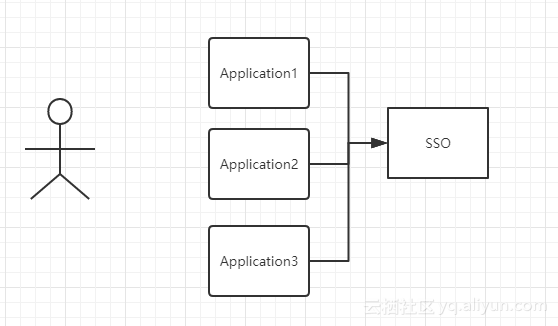

# 简介 #
单点登录 SSO，简洁一点的说，就是在一个多系统共存的环境下，用户的一次登录，就能得到其他所有系统的信任。

单点登录在大型网站里使用得非常频繁，例如像阿里巴巴这样的网站，在网站的背后是成百上千的子系统，用户一次操作或交易可能涉及到几十个子系统的协作，如果每个子系统都需要用户认证，不仅用户会疯掉，各子系统也会为这种重复认证授权的逻辑搞疯掉。

实现单点登录，说到底就是要解决两个问题：

1. 如何存储信任
2. 如何验证信任

单点登录有很多种实现方式，下面可以从简单、不安全到复杂、安全的角度一一介绍下：

## 以 Cookie 作为凭证媒介 ##
最简单的单点登录方式，就是使用客户端 Cookie 作为媒介存放用户登录凭证。用户登录父应用后，父应用返回一个加密过的 cookie 存放在客户端中，当用户访问子应用的时候，携带上这个 cookie，授权应用解密 cookie 并进行校验，校验通过则登录当前用户。

不过上面方式用两个问题：

1. cookie 存放在客户端不安全
2. cookie 不能跨域访问

对于第一个问题，可以通过对 cookie 进行严格加密来提高安全度（当然前提是 cookie 的加密算法不泄露，不然也是很危险的）。而第二个问题就没法解决了，因为这是硬伤。

除非你是在a页面里面，点击一个按钮，然后跳转到b页面里面，这个时候到可以用【跨域资源共享】或者【代理服务器】来解决 ajax 跨域无法请求的问题，但实际情况是，你打开的是两个窗口去访问a和b页面，这个时候就 cookie 不能共享，也就没办法了。

## 通过 JSONP 实现 ##
对于跨域问题，可以使用 JSONP 实现。

用户在父应用中登录后，跟 Session 匹配的 Cookie 会存到客户端中，当用户需要登录子应用的时候，授权应用访问父应用提供的 JSONP 接口（注意这里是父应用提供的jsonp方法），并在请求中带上父应用域名下的 Cookie，父应用接收到请求，验证用户的登录状态，返回加密的信息，子应用通过解析返回来的加密信息来验证用户，如果通过验证则登录用户。

这种方式虽然能解决跨域问题，但是安全性其实跟把信任存储到Cookie是差不多的。如果一旦加密算法泄露了，攻击者可以在本地建立一个实现了登录接口的假冒父应用，通过绑定Host来把子应用发起的请求指向本地的假冒父应用，并作出回应。

因为攻击者完全可以按照加密算法来伪造响应请求，子应用接收到这个响应之后一样可以通过验证，并且登录特定用户。

同理，这种方式也是在一个页面做的跳转，不能做到多页面多窗口共享。而且 JSONP 只支持 get 请求。

## 通过页面重定向的方式 ##
最后一种介绍的方式，是通过父应用和子应用来回重定向中进行通信，实现信息的安全传递。

父应用提供一个GET方式的登录接口，用户通过子应用重定向连接的方式访问这个接口，如果用户还没有登录，则返回一个的登录页面，用户输入账号密码进行登录。如果用户已经登录了，则生成加密的Token，并且重定向到子应用提供的验证Token的接口，通过解密和校验之后，子应用登录当前用户。

这种方式较前面两种方式，接解决了上面两种方法暴露出来的安全性问题和跨域的问题，但是并没有前面两种方式方便。

# 使用独立登录系统（SSO） #
这种方式是目前比较流行的安全的单点登录方式。一般说来，大型应用会把授权的逻辑与用户信息的相关逻辑独立成一个应用，称为用户中心。

用户中心不处理业务逻辑，只是处理用户信息的管理以及授权给第三方应用。第三方应用需要登录的时候，则把用户的登录请求转发给用户中心进行处理，用户处理完毕返回凭证，第三方应用验证凭证，通过后就登录用户。

如图所示，图中有4个系统，分别是 Application1、Application2、Application3、和 SSO。

Application1、Application2、Application3 没有登录模块，而 SSO 只有登录模块，没有其他的业务模块，当 Application1、Application2、Application3 需要登录时，将跳到 SSO 系统，SSO 系统完成登录，其他的应用系统也就随之登录了。

## 顶域相同的单点登录 ##
一个企业一般情况下只有一个域名，通过二级域名区分不同的系统。比如我们有个域名叫做：a.com，同时有两个业务系统分别为：app1.a.com和app2.a.com。我们要做单点登录（SSO），需要一个登录系统，叫做：sso.a.com。

我们只要在sso.a.com登录，app1.a.com和app2.a.com就也登录了。通过上面的登陆认证机制，我们可以知道，在sso.a.com中登录了，其实是在sso.a.com的服务端的session中记录了登录状态，同时在浏览器端（Browser）的sso.a.com下写入了Cookie。

那么我们怎么才能让app1.a.com和app2.a.com登录呢？这里有两个问题：

1. Cookie是不能跨域的，我们Cookie的domain属性是sso.a.com，在给app1.a.com和app2.a.com发送请求是带不上的。
2. sso、app1和app2是不同的应用，它们的session存在自己的应用内，是不共享的。

那么我们如何解决这两个问题呢？针对第一个问题，sso登录以后，可以将Cookie的域设置为**顶域**，即.a.com，这样所有子域的系统都可以访问到顶域的Cookie。

**注意：顶域的所有信息，所有的子域是可以共享的，包括 cookie**

Cookie的问题解决了，我们再来看看session的问题。我们在sso系统登录了，这时再访问app1，Cookie也带到了app1的服务端（Server），app1的服务端怎么找到这个Cookie对应的Session呢？这里就要把3个系统的Session共享，如图所示：

这样同顶域下的单点登录就实现了。

## 不同顶域下的单点登录 ##
上面讲到了在同一个顶域下，通过对顶域设置 cookie 来实现单点登录；那如果是不同顶域的话，该如何做？

比如有 www.a.com 和 www.b.com，a 页面登录了，那么 b 页面也要实现登录。其实这里还是把登录系统单独抽离出来（SSO 登录系统），所有页面的登录，都是重定向到这个统一的登录系统，只是在这个统一的登录系统里面，设置 cookie 的方式不同，同顶域登录的话，只要设置顶域的 cookie 就可以了，这样其他同顶域的页面，都可以访问到这个 cookie 信息，而不顶域，这是需要服务端（SSO端），在 a 页面登录成功之后，把所有跨域的项目域的 cookie 都设置好。这样 b 在登录的时候，其实它的域里面已经提前设置好了 cookie。

也就是说 a 或 b 登录了之后，a 和 b 的域里面都已经种好了 cookie，各自页面在访问的时候，请求报文里面其实就已经带上了这个 cookie 信息，那么就可以完成一次登录，其他相关的域都登录，也就实现了不同域之间的单点登录。

实现这种不同顶域的单点登录，前提是在单点登录中心（SSO 系统）中，预先设置好相关联的所有域，比如 www.a.com 和 www.b.com 等等，有多少设置多少，这样他们其中任何一个登录了，就把所有的这些相关联的域都种上 cookie。那么下次其他域的成员访问时，都是带有 cookie 信息的访问。